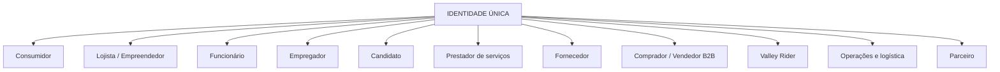
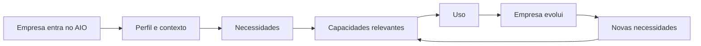
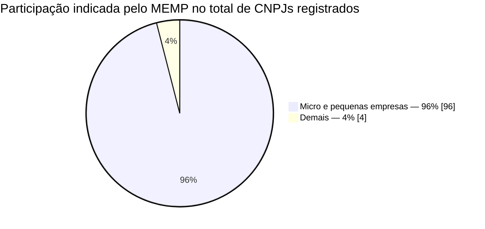
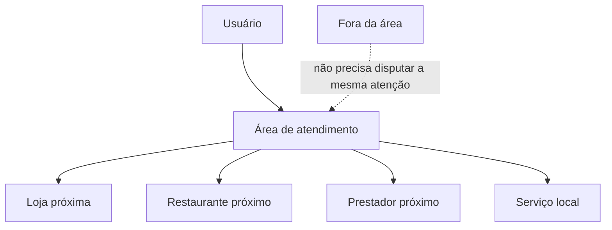
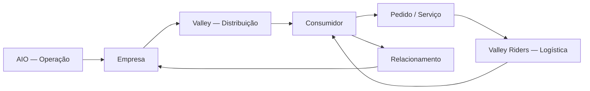
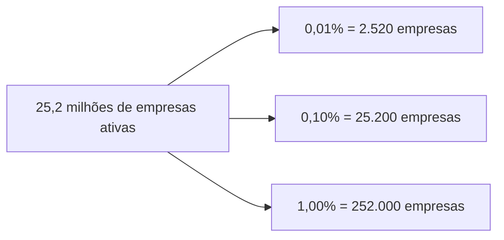
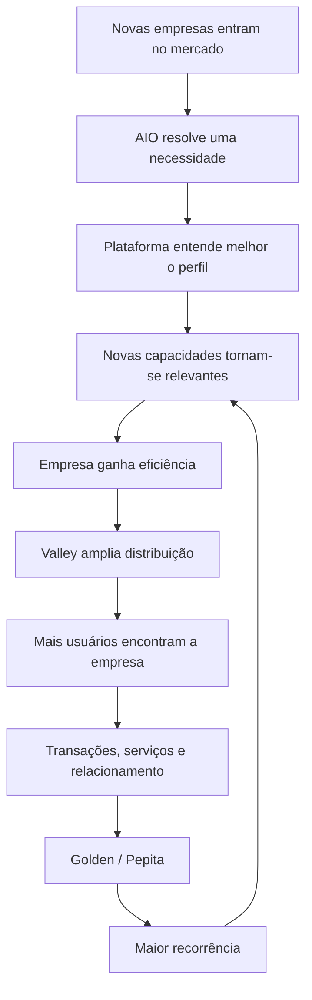

# AIO

## Uma identidade. Um ecossistema. Infraestrutura para empresas crescerem sem carregar complexidade desnecessária.

**Empresas e pessoas não deveriam precisar se fragmentar para participar da economia digital.**

Pequenos negócios normalmente começam simples: uma venda, uma planilha, uma conversa, uma maquininha, um funcionário, uma entrega. Conforme crescem, surgem novos sistemas, novos cadastros, integrações, fornecedores, treinamentos e custos.

Do outro lado, o consumidor enfrenta a mesma fragmentação: um aplicativo para comprar, outro para pedir, outro para contratar um serviço, outro para procurar emprego, outro para receber uma entrega e uma nova identidade digital em cada um deles.

O **AIO** propõe outra direção:

> **Uma identidade para a pessoa. Uma estrutura adaptável para a empresa. Um ecossistema capaz de conectar comércio, serviços, trabalho, relacionamento e logística.**

### [Acessar o projeto](https://brasildesconto.com/)

### Vídeo institucional

[▶ Assistir ao vídeo institucional — Identidade única, múltiplos papéis](https://drive.google.com/file/d/1O1AqOyLNa2oZ7NRmRPzNWuW0pDuIebaL/view)

---

# Duas fragmentações, uma mesma oportunidade

## A empresa está fragmentada

Uma pequena empresa pode precisar combinar mensagens, cadastro de clientes, vendas, estoque, financeiro, documentos, equipe, permissões, recrutamento, fornecedores, serviços, marketplace, logística, delivery, relacionamento, presença digital, relatórios e automações.

Cada nova necessidade pode significar mais um sistema, mais uma mensalidade, mais uma integração, mais treinamento e mais suporte.

O resultado é um paradoxo: **a empresa precisa se estruturar para crescer, mas a própria estrutura pode se tornar cara e complexa demais para o estágio em que ela se encontra.**

## O usuário final também está fragmentado

A mesma pessoa é recriada repetidamente em aplicativos diferentes.

Um cadastro para comprar. Outro para trabalhar. Outro para procurar emprego. Outro para contratar. Outro para vender. Outro para entregar. Outro para prestar um serviço.

Endereços são repetidos. Preferências são reconstruídas. Históricos começam do zero. Relações desaparecem quando o aplicativo muda.

A economia digital criou inúmeras versões digitais da mesma pessoa.

**O AIO propõe inverter essa lógica.**

---

# Uma pessoa. Uma identidade. Muitos papéis.

A identidade pertence à pessoa, não ao aplicativo.

No ecossistema AIO, a mesma identidade pode assumir diferentes papéis conforme o contexto. Uma pessoa pode ser, simultaneamente ou ao longo de sua jornada:

- consumidor ou cliente;
- lojista, empreendedor, proprietário, sócio ou gestor;
- funcionário ou membro de uma equipe;
- empregador ou recrutador;
- candidato a emprego;
- profissional autônomo ou prestador de serviços;
- contratante de serviços;
- fornecedor;
- comprador ou vendedor B2B;
- vendedor B2C;
- parceiro comercial;
- operador logístico;
- solicitante, remetente ou destinatário de uma entrega;
- entregador no **Valley Riders**;
- participante de programas de relacionamento;
- usuário de diferentes experiências do ecossistema.

Novos papéis podem surgir sem que uma nova identidade precise nascer para cada produto.

## A identidade permanece. O contexto muda.

Quando alguém compra um produto, está atuando como consumidor.

Quando trabalha em uma empresa, está atuando como funcionário.

Quando administra seu negócio, está atuando como gestor.

Quando procura uma oportunidade, está atuando como candidato.

Quando aceita uma entrega, está atuando como Rider.

**A pessoa continua sendo a mesma.**

Por isso, a proposta arquitetural separa:

**Identidade → Contexto → Papel → Permissão → Capacidade**

Identidade única não significa acesso indiscriminado. Dados pessoais, empresariais e profissionais permanecem sujeitos às permissões e separações apropriadas para cada contexto.

O objetivo é eliminar a duplicação da identidade, não eliminar as fronteiras de segurança.

---

# O AIO não entrega um canivete suíço

Plataformas empresariais amplas frequentemente entregam dezenas de funções e deixam para o cliente descobrir o que precisa usar.

Para uma pequena empresa, isso pode significar contratar uma plataforma grande para utilizar apenas uma fração dela.

O AIO propõe o contrário: **entender primeiro e apresentar depois.**

A experiência pode considerar fatores como:

- tipo e atividade do negócio;
- porte e estágio de desenvolvimento;
- estrutura existente;
- perfil operacional;
- equipe;
- canais de venda;
- necessidades e intenção do usuário;
- capacidades já utilizadas.

A partir desse contexto, a plataforma pode apresentar **o que faz sentido para aquela empresa naquele momento**.

Uma empresa com três pessoas não precisa receber a mesma experiência de uma organização com trezentas. Uma loja não precisa começar com funções destinadas a uma operação logística complexa. Um prestador de serviços não precisa navegar por ferramentas irrelevantes para sua atividade.

**A complexidade disponível pode ser grande sem que a complexidade apresentada ao usuário também seja.**

---

# Crescer junto com a empresa

A estratégia de entrada pode ser gradual:

1. **Entrar:** resolver uma dor clara e imediata.
2. **Conhecer:** entender melhor a operação e o contexto daquele negócio.
3. **Adaptar:** apresentar capacidades compatíveis com suas necessidades.
4. **Expandir:** adicionar novas capacidades conforme a empresa cresce.
5. **Conectar:** levar essa empresa para outras partes do ecossistema quando houver valor real.

O crescimento da plataforma pode acompanhar o crescimento do próprio cliente.

> **Não é necessário transformar uma pequena empresa em uma grande empresa para então atendê-la. A plataforma pode começar pequena junto com ela.**

Essa abordagem também cria uma hipótese econômica importante: a expansão da receita pode acontecer dentro da própria base, conforme clientes passam a utilizar novas capacidades.

---

# Um mercado estruturalmente grande

O Brasil possui **25,2 milhões de empresas ativas**, segundo o Mapa de Empresas do Governo Federal, com dados atualizados até junho de 2026. Somente em **junho de 2026 foram abertas aproximadamente 456 mil empresas**.

O Ministério do Empreendedorismo informa que **microempresas e empresas de pequeno porte respondem por 96% dos CNPJs registrados** no país.

Em 2024, o Brasil registrou **4,158 milhões de novos pequenos negócios**, segundo levantamento citado pelo Ministério do Empreendedorismo com base em dados do CNPJ da Receita Federal.

Esses números mostram uma característica central do mercado brasileiro: **milhões de negócios entram ou permanecem no mercado em escala pequena, exatamente onde simplicidade operacional, custo proporcional e capacidade de evolução podem ser decisivos.**

Porte empresarial não determina sozinho maturidade operacional. O ponto não é presumir que toda pequena empresa seja pouco estruturada, mas reconhecer que um mercado dominado por pequenos negócios favorece soluções capazes de entregar estrutura de forma proporcional, progressiva e acessível.

**Fontes:**

- [Governo Federal — Mapa de Empresas](https://www.gov.br/empresas-e-negocios/pt-br/mapa-de-empresas)
- [MEMP — Micro e pequenas empresas e participação nos CNPJs](https://www.gov.br/memp/pt-br/assuntos/noticias/no-dia-internacional-das-micro-e-pequenas-empresas-memp-destaca-acoes-estruturantes-em-credito-e-renegociacoes-1)
- [MEMP — 4,158 milhões de pequenos negócios abertos em 2024](https://www.gov.br/memp/pt-br/assuntos/noticias/r-1-bilhao-em-credito-para-pequenos-negocios-e-100-mil-renegociacoes-de-dividas-de-empresas-marcam-primeiro-ano-do-ministerio-do-empreendedorismo)

---

# O comércio local ainda possui uma vantagem enorme: distância

A digitalização criou escala, mas muitas vezes afastou digitalmente consumidores de estabelecimentos que estão fisicamente próximos deles.

Uma pessoa pode procurar algo em uma plataforma e receber resultados de estabelecimentos que estão longe, não entregam naquela região ou não conseguem atender economicamente aquele endereço. Enquanto isso, uma loja a poucas ruas de distância pode permanecer invisível.

O **Valley** propõe transformar proximidade em relevância.

## Mostrar aquilo que realmente pode chegar ao usuário

A experiência pode considerar a área de atendimento ou o raio de entrega do estabelecimento.

Para o usuário, isso pode significar resultados mais relevantes, descoberta de comércio próximo, possibilidade de entregas mais rápidas e acesso a empresas locais antes invisíveis.

Para o lojista, significa concentrar visibilidade onde existe capacidade real de atendimento, reduzir exposição desperdiçada fora da área operacional e competir também por proximidade, não apenas por tamanho de marca ou orçamento publicitário.

Para a logística, trajetos menores podem reduzir tempo e custo quando distância, disponibilidade e rota permitirem.

A proposta não é simplesmente criar outro catálogo. É construir uma **rede econômica de proximidade**.

---

# Do comércio local para uma rede econômica

Quando uma empresa utiliza o AIO, ela pode organizar sua operação.

Quando participa do Valley, pode ganhar distribuição.

Quando consumidores próximos descobrem essa empresa, surge demanda.

Quando existe demanda, entram serviços e logística.

Quando existem relações recorrentes, surgem novas superfícies de relacionamento.

O objetivo é que cada nova capacidade possa fortalecer as demais.

---

# Golden e Pepita: relacionamento nos dois lados

O ecossistema pode criar relações de valor tanto com quem vende quanto com quem compra.

## Golden — relacionamento com o lojista

**Golden** representa a camada de relacionamento com empresas e lojistas. A proposta é permitir que participação, consistência, qualidade, relacionamento e evolução dentro do ecossistema possam gerar reconhecimento e benefícios conforme políticas aplicáveis.

O lojista deixa de ser apenas um registro em um catálogo e passa a ser um participante da rede.

## Pepita — relacionamento com o usuário

**Pepita** representa a camada de relacionamento voltada ao usuário. A proposta é que participação e recorrência possam gerar valor perceptível dentro das experiências disponíveis no ecossistema, conforme as regras aplicáveis.

O objetivo é fortalecer uma relação contínua em vez de tratar cada interação como uma transação isolada.

Golden e Pepita formam, conceitualmente, dois lados de uma mesma estratégia: **criar razões para empresas permanecerem, consumidores retornarem e o ecossistema se tornar mais útil conforme cresce.**

---

# Menos dependência de suporte para crescer

Uma plataforma que precisa adicionar uma grande estrutura de atendimento para cada novo grupo de clientes encontra rapidamente um limite econômico.

Por isso, a proposta do AIO combina:

- experiência orientada por contexto;
- módulos independentes;
- onboarding progressivo;
- autosserviço;
- automação;
- permissões orientadas por papel;
- identidade compartilhada entre experiências;
- interfaces que apresentam somente capacidades relevantes;
- assistência contextual;
- evolução gradual do cliente.

O objetivo econômico é fazer a quantidade de clientes crescer mais rapidamente do que a necessidade de intervenção humana por cliente.

Isso não elimina suporte. Muda o papel do suporte. A operação humana pode se concentrar progressivamente em exceções e situações de maior valor, enquanto tarefas repetitivas são absorvidas pelo produto e pela automação.

---

# Uma base, múltiplas oportunidades de receita

O AIO foi concebido como uma plataforma modular. Isso permite explorar diferentes mecanismos econômicos sem depender exclusivamente de uma única vertical.

## Receita recorrente

Capacidades empresariais podem sustentar modelos de contratação recorrente.

## Expansão dentro da base

Uma empresa pode começar utilizando poucas capacidades e ampliar sua utilização conforme cresce.

## Serviços transacionais

Capacidades em que a plataforma participa diretamente da geração de valor podem sustentar modelos vinculados à utilização ou à transação, quando aplicável.

## Comércio e distribuição

A conexão entre empresas e consumidores cria novas superfícies econômicas.

## Serviços e trabalho

Prestadores, contratantes, empresas, profissionais e candidatos podem compartilhar a mesma infraestrutura de identidade e contexto.

## Logística

Valley Riders pode conectar demanda, estabelecimentos e capacidade de entrega.

## Ecossistema

Cada capacidade adicional pode aumentar o valor das capacidades já existentes.

---

# A diferença entre adquirir um usuário e expandir um usuário

Em muitos produtos digitais, crescer significa continuamente adquirir novos usuários.

Uma identidade multipapel cria outra possibilidade.

Um consumidor pode se tornar candidato. Um candidato pode se tornar funcionário. Um funcionário pode abrir uma empresa. Um empreendedor pode se tornar lojista. Um lojista pode contratar, comprar de fornecedores, vender, utilizar logística, contratar serviços e participar de novas experiências.

Isso cria uma hipótese econômica relevante:

> **Parte do crescimento futuro pode acontecer dentro da própria base de identidades, não apenas por aquisição externa.**

---

# Escalabilidade

Com aproximadamente **25,2 milhões de empresas ativas** no Brasil, pequenas taxas de penetração representam bases relevantes.

| Participação ilustrativa | Empresas |
|---:|---:|
| 0,01% | 2.520 |
| 0,10% | 25.200 |
| 1,00% | 252.000 |

Esses números **não representam previsão de participação de mercado, faturamento, valuation ou promessa de resultado**. Eles demonstram apenas a dimensão matemática do mercado sobre o qual a tese está sendo construída.

Uma forma simples de analisar cenários futuros é:

**Receita recorrente = empresas ativas na plataforma × receita média por empresa**

E, para expansão:

**Receita por relacionamento = cliente inicial + novas capacidades + serviços utilizados ao longo do tempo**

Cenários financeiros podem ser construídos sobre métricas observáveis conforme a operação comercial evolui, sem confundir hipótese com resultado realizado.

---

# O motor de crescimento

O AIO não precisa começar vendendo tudo. Precisa começar sendo útil. Depois, crescer junto.

---

# A visão

Imagine uma pessoa entrando no ecossistema como consumidora.

Ela possui uma identidade.

Meses depois procura emprego. A identidade continua.

Ela é contratada por uma empresa. A identidade continua.

Depois começa a prestar serviços. A identidade continua.

Mais tarde abre sua própria empresa. A identidade continua.

Sua empresa cresce e contrata pessoas. Ela passa a vender localmente, compra de fornecedores, contrata entregas e participa de novas experiências.

Seu papel muda. Sua empresa muda. Suas necessidades mudam.

**A identidade não precisa recomeçar.**

---

# A tese AIO

**Para a empresa:** dar somente a infraestrutura necessária para o estágio em que ela está.

**Para o consumidor:** reduzir fragmentação entre aplicativos, contas e experiências.

**Para a identidade:** permitir que uma pessoa exerça múltiplos papéis sem ser recriada digitalmente em cada contexto.

**Para o comércio local:** transformar proximidade física em relevância digital.

**Para logística:** conectar demanda local à capacidade de entrega e movimento.

**Para o relacionamento:** Golden para empresas e Pepita para usuários como camadas complementares de participação no ecossistema.

**Para o negócio:** construir receita recorrente, expansão dentro da base e novas superfícies econômicas sobre infraestrutura compartilhada.

**Para escala:** automatizar o que é repetitivo e reservar intervenção humana para aquilo que realmente exige intervenção humana.

---

# Não queremos construir apenas mais um aplicativo

Queremos reduzir a necessidade de vários deles.

Não queremos criar uma nova identidade para cada necessidade. Queremos permitir que uma identidade atravesse diferentes momentos da vida econômica.

Não queremos entregar dezenas de ferramentas para uma empresa que precisa de cinco. Queremos entregar as cinco e estar preparados quando ela precisar da sexta.

> **AIO é a infraestrutura. Valley é a conexão. A identidade é a continuidade. A empresa cresce. O usuário permanece.**

---

## Acesse

### [Conheça o projeto](https://brasildesconto.com/)

## Documentação pública

- [Visão geral](docs/overview.md)
- [Capacidades e evolução](docs/modules.md)
- [Arquitetura pública](docs/architecture-public.md)
- [Diretrizes técnicas e operação](docs/technical-operations-public.md)
- [Roadmap público](docs/roadmap-public.md)
- [Privacidade e segurança](docs/privacy-and-security.md)
- [Histórico público](CHANGELOG_PUBLIC.md)

---

**AIO**  
*Uma identidade. Múltiplos papéis. Empresas que começam simples e podem crescer sem trocar de infraestrutura a cada nova etapa.*
